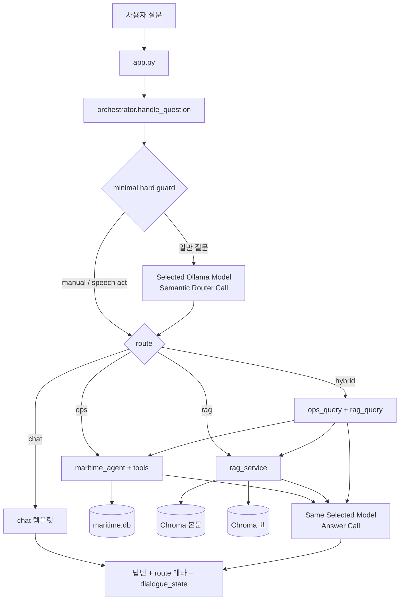

# MaritimeOpsRAG 시스템 아키텍처

[yoonmojeon/20260805](https://github.com/yoonmojeon/20260805)에서
운항(정형)과 문서(비정형)를 어떻게 나누고, 질문이 오면 어디로 보내는지 정리한 글입니다.

UI 절차는 [사용매뉴얼.md](사용매뉴얼.md), 표 인덱스 빌드는
[TABLE_EMBEDDING_PIPELINE.md](TABLE_EMBEDDING_PIPELINE.md).

---

## 0. 큰 그림

한 모델에 전부 넣지 않습니다.

1. 저장소를 미리 만들고 (빌드)
2. 질문이 오면 어느 저장소를 쓸지 고르고 (라우팅)
3. 그 경로의 실행기로 답을 만듭니다 (질의)

최상위는 “동향/MASS/표QA” 같은 주제가 아니라 **데이터 소스**입니다.

| 경로 | 의미 | 저장소 | LLM 역할 |
|------|------|--------|----------|
| `chat` | 인사·소개·능력·애매한 질문 | 없음 | 거의 없음 (템플릿) |
| `ops` | 이 선박의 운항·CII·리포트 | SQLite `data/maritime.db` | 툴 선택·문장화 |
| `rag` | 선급·IMO·규정·표 | Chroma (본문 + 표) | 검색 근거 기반 답변 |
| `hybrid` | 운항 숫자 + 문서 규정 같이 | SQLite + Chroma | 각각 실행 후 합침 |

```text
[빌드 타임]  운항 Excel → SQLite
             PDF 본문  → 텍스트 청크 → Chroma (본문)
             PDF 표    → TATR 정밀 표 → Chroma (표)

[질의 타임]  질문 → minimal hard guard → selected LLM semantic router
             → chat | ops | rag | hybrid → 검색/도구 → same selected LLM answer
```

라우팅은 인덱스를 만드는 단계가 아닙니다. 이미 준비된 DB/Chroma 중
질문마다 문을 고르는 스위치입니다.

### 질문 예시

```text
현재 CII 알려줘
  → ops → Tool → SQLite

MSC 111 주요 결과 알려줘
  → rag → Text Chroma

선령별 탱크 검사 범위 알려줘
  → rag → Table Chroma → 원본 표 crop

우리 CII와 관련 규정 같이 알려줘
  → hybrid → ops + rag
```

---

## 1. 왜 데이터를 둘로 나누나

| 구분 | 운항 (ops) | 문서 (rag) |
|------|------------|------------|
| 원천 | 센서·Noon·스케줄 Excel | 선급 Rule, IMO MEPC/MSC PDF |
| 성격 | 숫자, 시간, 항차 ID | 문장, 조항, 표 격자 |
| “정답”의 의미 | 계산·집계가 재현 가능해야 함 | 근거 문단·표 셀을 인용해야 함 |
| 실패 모드 | DB/항차/연도 데이터 없음 | 검색 미스, 요약 실패 |
| 처리 방식 | SQL + 공식(CII) + 리포트 생성 | 임베딩 검색 + LLM |

같은 단어(예: `CII`)라도 단서가 다릅니다.

- “올해 우리 배 CII” → **ops** (온보드 계산)
- “MEPC에서 CII 규제” → **rag** (문서)

이 구분을 UI에서 선택한 Ollama 모델이 질문 전체의 의미와 대화 문맥을 보고 수행합니다.

---

## 2. 빌드 타임 — 운항(정형) 파이프라인

### 2.1 원천과 결과물

| 항목 | 경로 |
|------|------|
| 원천 Excel | `data/ho_data/*.xlsx` |
| 로더 | `ops/scripts/load_hodata.py` |
| 결과 DB | `data/maritime.db` |
| 스키마·접근 | `ops/agent/db_schema.py`, `ops/agent/data_store.py` |

대략적인 테이블 역할:

- 선박 메타 (`vessel` 등)
- 시간별 센서 (`sensor_log`)
- 항차 (`voyages` — Schedule 우선, 없으면 SOG 등으로 추정)

### 2.2 질의 시 실행 경로

```text
질문 (ops로 라우팅됨)
  → services/ops_service.run_ops_query
  → ops/agent/maritime_agent.py   # Ollama tool-calling 루프
  → ops/agent/tools.py            # SQL 집계 / 리포트
  → ops/agent/cii.py              # CII 공식·등급 (단일 소스)
  → (선택) 항차 지도 HTML, Noon/MRV docx
```

대표 툴 예:

- `get_current_voyage_status` — 현재 항차·위치·속도 등
- `get_voyage_analysis` — 항차 분석
- `calculate_cii_rating` — attained/required CII·등급
- `calculate_emissions` — 배출량
- `generate_noon_report` / `generate_mrv_*` — 보고서 생성

프롬프트(툴 사용 규칙)는 `prompts/ops.py`만 수정합니다.

### 2.3 운항 경로에서 지킬 것

- 숫자는 툴/SQL 결과를 쓴다. 모델이 임의로 만들지 않는다.
- 데이터가 없으면 “없음/계산 불가”가 맞다.
- 규정 해석·회의 요약은 ops가 아니다.

---

## 3. 빌드 타임 — 문서(비정형) 파이프라인

PDF는 **본문**과 **표**의 정보 구조가 달라 인덱스를 분리합니다.
경로·기본 컬렉션 이름은 `project_paths.py`가 단일 기준입니다.

| 항목 | 기본값 |
|------|--------|
| PDF 원본 | `data/raw_pdfs/` (로컬; Git에 대용량 PDF는 보통 없음) |
| 본문 청크 | `data/processed/chunks/` |
| 정밀 표 청크 | `data/processed/chunks_tables_precise/` |
| Chroma 루트 | `data/processed/index/unified_<collection_id>/` |
| 본문 컬렉션 | `full_corpus_715_v1` |
| 표 컬렉션 | `full_corpus_715_tables_precise_v1` |
| Corpus PDF 수 | **715** (`full_corpus_715.csv` / `raw_pdfs`) |
| Text 인덱싱 | **714** — WITHDRAWN stub 1건은 텍스트 0이라 제외 |
| Table 인덱싱 | **529** — 표 없음 179 + filtered 7 + indexed 529 |

자세한 coverage 감사: `scripts/audit_text_coverage.py`, `scripts/audit_table_coverage.py`,
결과 JSON은 `data/eval/text_corpus_coverage.json`, `data/eval/table_coverage_audit.json`.

### 3.1 본문 인덱스

```text
PDF
 → 레이아웃/전처리
 → 텍스트(및 picture) 청크
 → e5 임베딩
 → Chroma: full_corpus_715_v1
 → (선택) BM25 희소 인덱스
```

관련 스크립트 예: `rag/scripts/rebuild_full_corpus_715.py`,
`rag/scripts/10_build_unified_index.py`, `rag/scripts/35_build_bm25_index.py`.

본문 인덱스에는 표를 거의 넣지 않고, 표 질문은 아래 정밀 표 인덱스로 보낸다.

### 3.2 정밀 표 인덱스

표는 문장 검색만으로 셀·주기·선령 구간이 잘 안 맞는다.
탐지 → 구조 → 좌표 스냅 → 텍스트 → (KR) 특수문자 복원 → 청킹 → 인덱스 순으로 만든다.

대표 오케스트레이터: `rag/scripts/70_build_precise_table_corpus.py`  
약한 표 수리/격리: `rag/scripts/71_repair_weak_precise_tables.py`

개념적 단계:

```text
preprocess / prepare
  → TATR 구조 인식
  → PDF 벡터 좌표에 snap
  → PyMuPDF 셀 텍스트
  → HancomEQN PUA 복원 (KR 등; 미매핑은 quarantine)
  → 복합 표 segment / region-TATR (필요 시)
  → table_row + table_summary 청크
  → Chroma: full_corpus_715_tables_precise_v1
```

검색용 청크는 Markdown 표 복사가 아니라 `열N=값 | …` 평문에 가깝다.
화면에는 그 표의 PDF crop을 보여 준다.

빌드 방법: [TABLE_EMBEDDING_PIPELINE.md](TABLE_EMBEDDING_PIPELINE.md)

### 3.3 질의 시 RAG 실행

```text
질문 (rag로 라우팅됨)
  → services/rag_service.run_rag_query
  → (표 힌트?) 표 인덱스 / dual 검색
  → rag/scripts/rag_inprocess.py 등 검색·생성
  → answer_contract 로 답변 형식 정리
```

**Retrieval mode** (`services/retrieval_mode.py`): RAG 질문 안에서
`TEXT` / `TABLE` / `BOTH`를 rule 기반으로 고른다.

| Mode | 언제 | 검색 |
|------|------|------|
| TEXT | 회의 결과·정의·취지 등 본문 | `full_corpus_715_v1` |
| TABLE | 선령/주기/표 값·행 질의 | `full_corpus_715_tables_precise_v1` |
| BOTH | 취지+선령별 범위처럼 본문·표 동시 필요 | 두 인덱스 검색 후 fuse |

표 단서가 애매하면 BOTH로 간다. UI에는 Evidence Table과 `crop_path` 이미지를 붙인다
(`services/answer_ui.py`, `services/table_render.py`). 모델이 표 셀을 새로 그리지 않는다.

**TEXT 계층 검색:** 기존 E5/Chroma 임베딩을 다시 만들지 않고 `source → document → clause/page → paragraph` 순서로 좁힌다. 첫 dense 후보를 문서별로 집계한 뒤 선택 문서 안에서 2차 dense 검색을 하고, `tcorr`, `AC-SD`, IMO 문서번호, DNV 문서코드 같은 exact identifier가 있으면 literal 후보와 문서 내부 sparse 점수를 합친다. 전역 Rule BM25는 기본 OFF이며 비교용 `MARITIME_RULE_GLOBAL_BM25=1`에서만 사용한다. 계층 검색 비교용 off switch는 `MARITIME_TEXT_HIERARCHICAL=0`이다.

**TABLE 셀 검증:** 먼저 한 `table_id`를 고정하고 row anchor와 column/attribute가 같은 셀에서 교차하는지 확인한다. 병합된 그룹 헤더는 `상위 헤더 → 항복/좌굴 같은 하위 헤더 → 열N 값` 경로를 복원한다. 교차점이나 점수 간격이 불충분하면 LLM이 값을 추측하지 않고 확인 불가 응답을 낸다.

진단:

```powershell
python scripts/inspect_rag_indexes.py
```

**표 청크 실제 형태 (코드·Chroma 기준):** Markdown 표를 임베딩하지 않는다.
`70_build_precise_table_corpus.serialize_rows`가 셀을
`열N=헤더경로: 값 | …` 평문으로 직렬화한다. 예:

```text
[table_row] source=ABS file=….pdf
표: …_p0013_t006
문서: ….pdf, 13쪽
열1=Quantity in Operations: Frequency | 열2=Permanent Variation: ±5% | 열3=Transient Variation: ±10% (5s)
```

메타데이터에 `table_id`, `page_number`, `crop_path`(원본 crop 경로), `chunk_type`
(`table_row` / `table_summary`)가 있다.

환경변수로 컬렉션을 바꿀 수 있다 (기본은 `project_paths.py`):

- `MARITIME_RAG_TEXT_COLLECTION`
- `MARITIME_RAG_TABLE_COLLECTION`

---

## 4. 질의 타임 — 라우팅

### 4.1 위치

```text
app.py (Gradio)
  → services/orchestrator.handle_question
  → router.intent_router.route_question
  → chat_service | ops_service | rag_service | hybrid_service
```

프롬프트:

- `prompts/chat.py` — 안내
- `prompts/ops.py` — 운항 에이전트
- `prompts/rag.py` — RAG 정체성
- `prompts/router_prompt.py` — primary semantic source router

fallback 단서·점수: `router/cues.py`
대화 상태: `router/dialogue.py`  
질문 펼치기·hybrid 분해: `router/rewrite.py`

### 4.2 분류 원칙

- Router call은 답을 만들지 않고 `need_ops`, `need_documents`, `confidence`, 짧은 이유와 source별 query만 JSON으로 반환한다.
- Python이 두 boolean을 `chat / ops / rag / hybrid`로 deterministic하게 변환한다.
- Router와 Answer는 **같은 active model**을 쓰되 반드시 별도 호출이다. 별도 `ROUTER_MODEL`은 없다.
- CII/배출 같은 중첩 용어도 keyword 수가 아니라 source requirement로 나눈다.
  - “올해 우리 배 CII” → ops
  - “MEPC CII 규제” → rag
  - “우리 배 CII가 MEPC 기준에 맞나” → hybrid
- 능력 질문(“운항이랑 문서 둘 다 가능해?”)은 **chat** (내용 요청이 아님).
- LLM이 문서 단서가 전혀 없는 고신뢰 OPS 질문을 hybrid로 넓힌 경우에는 `llm_guarded`가 RAG 호출만 제거한다. `같이`는 선박/운항 단서와 규정/문서 단서가 함께 있을 때만 dual-source 표지로 본다.
- RAG 안의 `TEXT / TABLE / BOTH` 선택은 이 변경 대상이 아니며 기존 parser/rule을 유지한다.

### 4.3 대략적인 결정 순서

1. 강제 경로 (UI에서 ops/rag/chat/hybrid 지정)
2. 화행: 인사 / 감사 / 메타 / 능력·소개 → `chat`
3. `expand_question()`으로 현재 질문과 대화 상태를 결합
4. 선택 모델에 source-needs JSON 요청 (`temperature=0`, `stream=false`, `think=false` 우선)
5. confidence 0.65 이상인 정상 결과를 route로 변환
6. 근거 없는 hybrid 과대분류는 고신뢰 OPS로 축소
7. timeout, unavailable, invalid/empty JSON, 필드·boolean 오류, 저신뢰면 기존 rule score → prototype → technical shape → safe chat 순으로 fallback

기존 `OPS_PATTERNS`, `RAG_PATTERNS`, `score_question()`, `prototype_vote()`는 삭제하지 않고 fallback/diagnostic으로만 남깁니다. `RouteDecision`에는 모델, source booleans, LLM 성공/실패, fallback 이유, latency가 기록됩니다.

### 4.4 Hybrid

원문을 그대로 두 번 넣지 않습니다.

1. Router가 정상적인 `ops_query`, `rag_query`를 주면 사용
2. 비었거나 품질이 나쁘면 `split_hybrid_queries`로 복구
3. SQLite와 RAG를 각각 실행
4. 같은 active model의 별도 합성 호출로 두 근거를 결합하고, 실패 시 출처 라벨 merge로 복구

### 4.5 멀티턴

`dialogue_state`에 최근 경로·주제·엔티티를 유지합니다.
`current`, `expanded`, `last_route`, `last_topic`, `last_question`을 Router에게 전달합니다.
짧은 후속 질문도 확장된 의미를 기준으로 source를 다시 판단합니다.

---

## 5. 사용자 질문 한 번의 전체 흐름



개념상 응답에 실리는 것:

- 답변 텍스트
- `route`, `need_ops`, `need_documents`, confidence, method
- active/router/answer model, router latency, fallback 여부·이유
- (ops) 생성 파일, 지도 HTML
- 다음 턴용 `dialogue_state`

---

## 6. 디렉터리 지도

```text
20260805/
├── app.py                 # 통합 Gradio UI
├── project_paths.py       # DB/컬렉션 기본 경로
├── router/                # 의도 분류 (cues, dialogue, rewrite)
├── prompts/               # chat / ops / rag / router 프롬프트만
├── services/              # orchestrator + chat/ops/rag/hybrid 브리지
├── ops/
│   ├── scripts/load_hodata.py
│   └── agent/             # tools, cii, maritime_agent, data_store
├── rag/
│   └── scripts/           # 전처리·인덱스·검색·표 파이프라인
├── data/
│   ├── ho_data/           # 운항 Excel (로컬)
│   ├── maritime.db        # 운항 SQLite (로컬 생성)
│   ├── raw_pdfs/          # PDF (로컬; 보통 Git 제외)
│   ├── manifests/         # 코퍼스 목록
│   ├── config/            # HancomEQN 매핑 등
│   ├── eval/              # 혼합 평가 스위트 등
│   └── processed/         # chunks / chroma / logs (로컬)
├── docs/                  # 본 문서, 매뉴얼, 표 파이프라인
├── scripts/               # 평가·빌드 헬퍼
└── tests/                 # 라우터 골든 등
```

Git에 안 올리는 것(일반적): 원본 PDF, 모델 가중치, Chroma 바이너리,
대용량 청크·로그, `.venv`, API 키.

---

## 7. 평가

- 품질 스모크: `python scripts/run_quality_30.py`
- 카테고리 스모크: `python scripts/run_smoke_categories.py`
- rules-only vs 3모델 라우터: `python tests/run_router_eval.py`
- 3모델 router + E2E 전체: `python scripts/compare_models.py`

2026-08-11 동일 조건 실측 결과:

| 모델 | Router | Held-out | Multi-turn | E2E QA | mismatch | empty/failure | Router 평균 | E2E 평균 |
|------|--------|----------|------------|--------|----------|---------------|-------------|----------|
| llama3.1:8b | 91.8% | 100% | 90% | 25/30 | 0 | 0 | 652 ms | 5.9 s |
| **gemma4:12b** | **96.9%** | **100%** | 90% | **27/30** | 0 | 0 | 1,529 ms | 9.1 s |
| mistral-nemo:12b | 94.4% | 100% | 90% | 22/30 | 4 | 0 | 843 ms | 6.0 s |

rules-only는 전체 192/195(98.5%)였지만 semantic held-out은 20/23(87.0%)였고, LLM-primary 세 모델은 held-out 23/23(100%)였습니다. E2E quality 우선 규칙에 따라 `gemma4:12b`를 기본값으로 선택했습니다. 상세 JSON은 `data/eval/model_comparison.json`입니다.

계층 검색·표 셀·회의 주제 보강용 신규 20문항에서는 Gemma LLM-primary가 보강 전 13/20(65%)에서 보강 후 20/20(100%)로 개선됐습니다. 평균 응답 8.98초, route mismatch·빈 답변·실행 실패는 0건입니다. 질문과 결과는 `data/eval/hierarchical_retrieval_20.jsonl`, `data/eval/hierarchical_retrieval_20_gemma4_12b_after.json`에 있습니다.

범용 표 질문을 많이 섞은 50문항 스트레스 테스트에서는 route 50/50, 빈 답변·실행 실패 0건이었지만 엄격 QA는 25/50이었습니다. 비범용표 유형과 파일/페이지가 특정된 표 질문은 17/17, 파일/페이지 없는 `table_open`은 8 PASS / 3 WEAK / 21 FAIL, `table_reporting`은 0/1이었습니다. 이는 source router보다 `table_id → row → column/cell` 후보 선택이 현재의 주 병목임을 보여 줍니다. 결과는 `data/eval/quality_50_open_mix_gemma4_12b_current.json`에 있습니다.

최종 답변을 생성하지 않고 경로만 보는 100문항 세트에서는 Gemma LLM-primary가 100/100(평균 1.42초, fallback 0건), Rules-only가 99/100(평균 0.24ms)이었습니다. Rules-only는 `소개해줘` 한 건을 `rag`로 오분류했습니다. 재현 실행기는 `scripts/run_route_suite.py`, 결과는 `data/eval/suite_100_mixed_gemma4_12b_current.json`과 `data/eval/suite_100_mixed_rules_current.json`입니다.

`route_mismatch`면 단서/라우터 쪽을 보고, ops `weak`면 DB·툴, rag `weak`면 검색·커버리지를 본다.

---

## 8. 코드 따라가기

1. 이 문서 — 큰 그림
2. `services/orchestrator.py` — 경로 스위치
3. `router/intent_router.py`, `router/cues.py`
4. `ops/scripts/load_hodata.py` → `ops/agent/tools.py` → `ops/agent/cii.py`
5. `project_paths.py` — 컬렉션 이름
6. `docs/TABLE_EMBEDDING_PIPELINE.md`, `rag/scripts/70_build_precise_table_corpus.py`
7. `services/rag_service.py` — 본문/표/BOTH
8. `docs/사용매뉴얼.md` — UI로 확인

---

## 9. FAQ

**Q. 라우팅이 먼저인가, 데이터 처리가 먼저인가?**  
A. 데이터 처리가 먼저다. `load_hodata` / Chroma가 있어야 ops·rag가 의미가 있다.

**Q. 표 QA는 최상위 경로인가?**  
A. 아니다. 최상위는 `rag`이고, 표/본문 선택은 RAG 안에서 한다.

**Q. chat에서도 LLM을 쓰나?**  
A. 인사·안내는 템플릿이다. SQLite/Chroma는 건드리지 않는다.

**Q. hybrid와 “둘 다 가능해?”의 차이**  
A. “가능해?”는 능력 질문 → chat.  
“운항이랑 문서 둘 다 알려줘”처럼 내용이면 → hybrid.

**Q. 로컬에 인덱스가 없으면?**  
A. 앱은 뜨지만 rag/ops가 준비 안내를 낸다. 매뉴얼의 상태 확인을 쓰면 된다.

---

## 10. 관련 링크

- 저장소: https://github.com/yoonmojeon/20260805
- 사용 매뉴얼: [사용매뉴얼.md](사용매뉴얼.md)
- 표 임베딩 파이프라인: [TABLE_EMBEDDING_PIPELINE.md](TABLE_EMBEDDING_PIPELINE.md)
