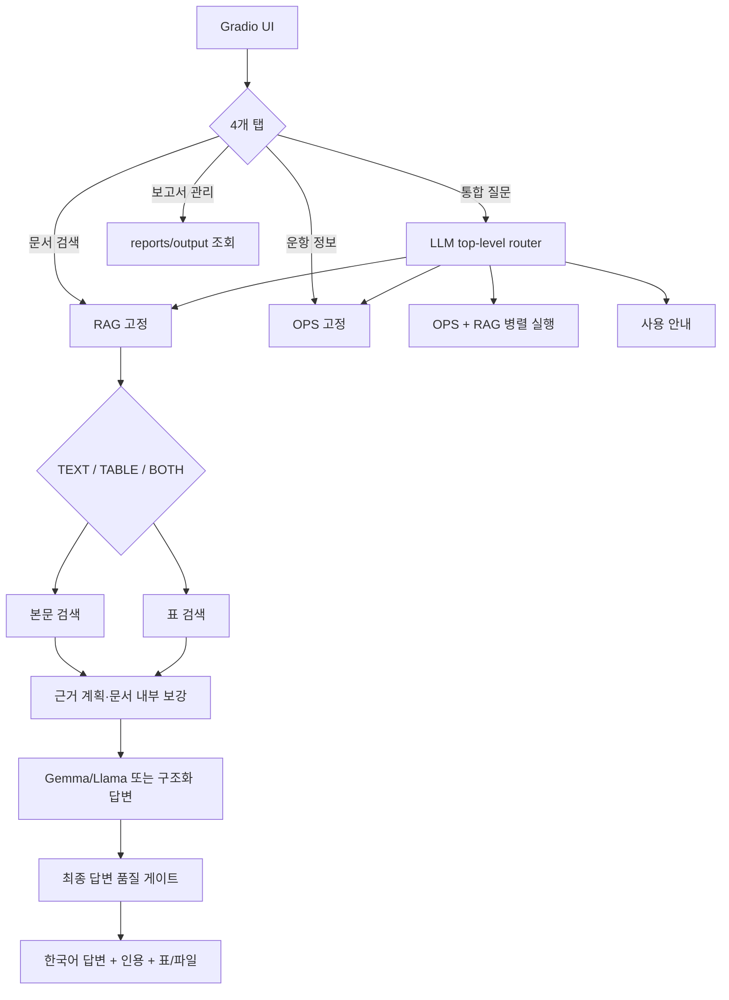

# 아키텍처·라우팅·임베딩·검색

이 문서는 현재 서비스 코드의 실제 동작만 설명합니다. 과거 rule-router 비교 실험과 Mistral 구성은 현재 구조에 포함되지 않습니다.

## 전체 흐름



| 영역 | 현재 진입점 |
|---|---|
| UI·보고서 관리 | `app.py` |
| 최상위 orchestration | `services/orchestrator.py` |
| 통합 질문 라우팅 | `router/intent_router.py` |
| 문서 RAG 서비스 | `services/rag_service.py` |
| 운항 서비스 | `services/ops_service.py` |
| 운항+문서 병렬 실행 | `services/hybrid_service.py` |
| 본문/표 모드 | `services/retrieval_mode.py` |
| 검색 실행 | `rag/scripts/rag_inprocess.py` |
| 질문 신호 분석 | `rag/scripts/retrieval_query_analysis.py` |
| 후보 검색·재순위 | `rag/scripts/retrieval_search.py` |
| evidence 계획 | `rag/scripts/evidence_planner.py` |
| 답변 계약 | `rag/scripts/answer_contract.py` |
| 최종 RAG 품질 게이트 | `services/rag_answer_guard.py` |

## 라우팅

### UI 탭

- **통합 질문**: LLM이 `chat`, `ops`, `rag`, `hybrid` 중 정보원을 판단합니다.
- **문서 검색**: 최상위 라우터를 건너뛰고 `rag`로 고정합니다.
- **운항 정보**: 최상위 라우터를 건너뛰고 `ops`로 고정합니다.
- **보고서 관리**: 모델을 호출하지 않고 실제 생성 파일만 조회합니다.

과거의 rule router 선택 기능은 없습니다. 다만 LLM 호출 실패, JSON 불량, 저신뢰로 서비스가 멈추는 것을 막기 위한 hard guard와 결정적 fallback은 남겨 두었습니다. 통합 탭의 정보원 강제 선택은 디버깅용 override이지 별도 rule router가 아닙니다.

`hybrid`는 질문을 운항용·문서용으로 분리하고 두 경로를 병렬 실행합니다. 기본적으로 두 근거 답변을 손실 없이 합치며, 환경변수 `MARITIME_HYBRID_SYNTHESIS=1`일 때만 추가 LLM 종합을 수행합니다.

### RAG 내부 모드

`rag` 진입 후 질문을 다시 구분합니다.

- `text`: 규정 설명, 회의 결과, 적용범위, 정의, 요구사항
- `table`: 시험 횟수, 허용값, 수치, 특정 행·열
- `both`: 표 수치와 본문 조건을 함께 요구

## 임베딩과 인덱스

본문과 표는 같은 임베딩 모델을 사용하지만 collection을 분리합니다.

| 항목 | 본문 | 표 |
|---|---|---|
| collection | `full_corpus_715_v1` | `full_corpus_715_tables_precise_v1` |
| 모델 | `intfloat/multilingual-e5-base` | 동일 |
| revision | `d128750597153bb5987e10b1c3493a34e5a4502a` | 동일 |
| chunk 정책 | `chunk-v1-420-60` | 동일 |
| 최대 토큰 / overlap | 420 / 60 | 420 / 60 |
| 구조화 표 | 제외 | 표만 포함 |

manifest는 각 인덱스의 `index_manifest.json`에 있습니다. 이번 검색·답변 개선은 기존 Chroma와 BM25 자료를 사용하므로 재임베딩이 필요하지 않습니다.

```powershell
$env:MARITIME_RAG_TEXT_COLLECTION="full_corpus_715_v1"
$env:MARITIME_RAG_TABLE_COLLECTION="full_corpus_715_tables_precise_v1"
```

## 현재 검색 알고리즘

### 1. 질문 분석

다음 신호를 추출해 검색 profile과 evidence slot을 만듭니다.

- 회의·차수: `MSC 111`, `MEPC 84`
- 문서·조항 식별자: `DNV-CG-0264`, `Section 15`, `Part 7`
- 선급·포함·제외 조건
- 제안, 작업반 논의, 승인, 채택, 발효 등 문서 상태
- 정의·범위·수치·일정·비교·표 요구
- 한·영 동의어와 기술 용어

### 2. 후보 문서 회수

1. E5 dense 검색으로 의미가 가까운 청크를 찾습니다.
2. BM25로 문서코드·조항·수치 literal match를 보강합니다.
3. RRF와 카테고리 가중치로 결합합니다.
4. 정확 식별자가 있으면 파일명·registry·메타데이터에서 직접 후보에 넣습니다.
5. 질문의 회의차수·선급·문서 종류와 충돌하는 후보는 감점하거나 제외합니다.

목표는 먼저 정답 문서가 후보군에 들어오게 하는 것입니다.

### 3. 문서 내부 근거 검색

문서를 찾은 뒤 질문을 정의·범위·수치·일정·결론 같은 slot으로 나눠 문서 안에서 다시 검색합니다. sparse 조항 검색, focus term, bilingual alias를 함께 사용하고 중복 청크를 줄입니다. 회의 결과는 제안문보다 report/WP의 결정 문구를 우선합니다.

여러 문서를 비교하는 질문은 문서별 최소 근거를 유지합니다. ABS Smart Functions와 Autonomous/Remote Requirements처럼 문서명이 명시된 비교는 정확 파일명으로 필요한 metadata를 보강합니다. 이는 기존 collection에서 문서 행을 가져오는 것이며 새 임베딩 검색이 아닙니다.

### 4. 표 검색

표 질문은 precise-table collection에서 table row, markdown, summary 청크를 함께 찾습니다. 답변에는 수치뿐 아니라 원문 PDF·페이지·표 crop을 연결합니다. 본문 조건도 필요하면 `both` 모드로 두 근거를 합칩니다.

## 답변 생성과 품질 게이트

선택된 근거를 Gemma/Llama에 전달하고 `[n]` 인용을 생성합니다. 정확한 조항 비교나 반복 실패 유형은 근거 기반 구조화 renderer가 모델 생성을 대체할 수 있습니다.

생성 후 `rag_answer_guard.py`가 다음만 검사합니다.

- 문서에 없는 발효일·결의번호·인증번호·제조사 목록을 주변 문서 설명으로 대체하지 않았는가
- 질문의 잘못된 전제를 명시적으로 맞다/틀리다 판정했는가
- ABS 위험범주, Smart Functions 적용범위, SFCS 날짜처럼 근거에 있는 정확 사실을 보존했는가
- 네 답변 섹션이 비어 있거나 영어 원문만 노출되지 않았는가
- 인용 번호가 실제 Evidence Table 범위 안에 있는가

명확한 패턴은 결정적으로 고치고, 그 외 실제 결함 답변만 활성 모델로 한 번 재작성합니다. 따라서 일반 질문은 추가 LLM 비용이 없고, 잘못된 전제처럼 검증이 필요한 일부 질문만 느려질 수 있습니다.

## 속도와 한계

- 일반 문서 회귀 10문항 평균은 약 5초였습니다.
- 45개 집중 표본 평균은 6.55초였습니다.
- 전제 교정처럼 추가 품질 재작성이 필요한 질문은 평균 약 21초까지 늘 수 있습니다.
- 정확 문서코드가 있는 단일 문서 질의는 안정적이지만, 긴 문서의 멀리 떨어진 조항을 여러 개 요구하거나 여러 문서를 동시에 통합하면 일부 keypoint 누락이 남을 수 있습니다.
- 근거가 인덱스에 없는 질문은 보완 생성하지 않고 확인 불가로 답합니다.

평가셋 구성과 수치의 범위는 [평가 방법과 결과](EVALUATION.md)를 확인하세요.
