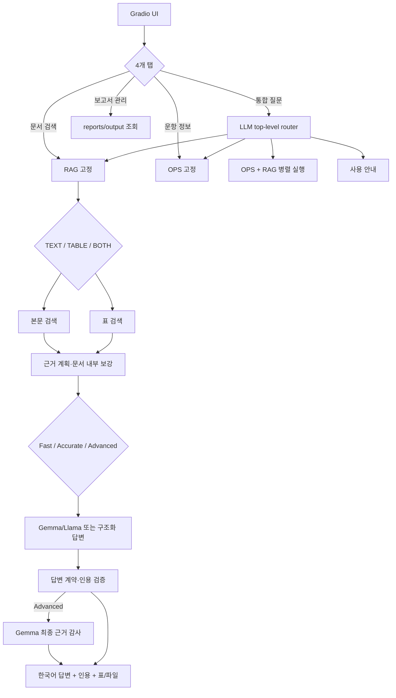

# 아키텍처·라우팅·임베딩·검색

이 문서는 현재 서비스 코드의 실제 동작만 설명합니다. 과거 rule-router 비교 실험과 Mistral 구성은 현재 구조에 포함되지 않습니다.

## 전체 흐름



| 영역 | 현재 진입점 |
|---|---|
| UI·보고서 관리 | `app.py` |
| 최상위 orchestration | `services/orchestrator.py` |
| 통합 질문 라우팅 | `router/intent_router.py` |
| 문서 RAG 서비스 | `services/rag_service.py` |
| 운항 서비스 | `services/ops_service.py` |
| 운항+문서 병렬 실행 | `services/hybrid_service.py` |
| 본문/표 모드 | `services/retrieval_mode.py` |
| 검색 실행 | `rag/scripts/rag_inprocess.py` |
| 질문 신호 분석 | `rag/scripts/retrieval_query_analysis.py` |
| 후보 검색·재순위 | `rag/scripts/retrieval_search.py` |
| Advanced FTS/BM25·RRF | `rag/scripts/accurate_hybrid_v2.py` |
| Advanced 계획·listwise·감사 | `rag/scripts/advanced_mode.py` |
| 로컬 cross-encoder | `rag/scripts/local_cross_encoder_reranker.py` |
| parent/sibling 문맥 | `rag/scripts/adjacent_chunk_expansion.py` |
| evidence 계획 | `rag/scripts/evidence_planner.py` |
| 답변 계약 | `rag/scripts/answer_contract.py` |
| 최종 RAG 품질 게이트 | `services/rag_answer_guard.py` |

## 라우팅

### UI 탭

- **통합 질문**: LLM이 `chat`, `ops`, `rag`, `hybrid` 중 정보원을 판단합니다.
- **문서 검색**: 최상위 라우터를 건너뛰고 `rag`로 고정합니다.
- **운항 정보**: 최상위 라우터를 건너뛰고 `ops`로 고정합니다.
- **보고서 관리**: 모델을 호출하지 않고 실제 생성 파일만 조회합니다.

과거의 rule router 선택 기능은 없습니다. 다만 LLM 호출 실패, JSON 불량, 저신뢰로 서비스가 멈추는 것을 막기 위한 hard guard와 결정적 fallback은 남겨 두었습니다. 통합 탭의 정보원 강제 선택은 디버깅용 override이지 별도 rule router가 아닙니다.

`hybrid`는 질문을 운항용·문서용으로 분리하고 두 경로를 병렬 실행합니다. 기본적으로 두 근거 답변을 손실 없이 합치며, 환경변수 `MARITIME_HYBRID_SYNTHESIS=1`일 때만 추가 LLM 종합을 수행합니다.

### RAG 내부 모드

`rag` 진입 후 질문을 다시 구분합니다.

- `text`: 규정 설명, 회의 결과, 적용범위, 정의, 요구사항
- `table`: 시험 횟수, 허용값, 수치, 특정 행·열
- `both`: 표 수치와 본문 조건을 함께 요구

## 임베딩과 인덱스

본문과 표는 같은 임베딩 모델을 사용하지만 collection을 분리합니다.

| 항목 | 본문 | 표 |
|---|---|---|
| collection | `full_corpus_715_v1` | `full_corpus_715_tables_precise_v1` |
| 모델 | `intfloat/multilingual-e5-base` | 동일 |
| revision | `d128750597153bb5987e10b1c3493a34e5a4502a` | 동일 |
| chunk 정책 | `chunk-v1-420-60` | 동일 |
| 최대 토큰 / overlap | 420 / 60 | 420 / 60 |
| 구조화 표 | 제외 | 표만 포함 |

manifest는 각 인덱스의 `index_manifest.json`에 있습니다. 이번 검색·답변 개선은 기존 Chroma와 BM25 자료를 사용하므로 재임베딩이 필요하지 않습니다.

```powershell
$env:MARITIME_RAG_TEXT_COLLECTION="full_corpus_715_v1"
$env:MARITIME_RAG_TABLE_COLLECTION="full_corpus_715_tables_precise_v1"
```

## 검색·답변 모드

### Fast

- 일반 본문은 `top_k=3`, dense fetch 10, pool 18의 짧은 문맥을 사용합니다. 회의·Rule/Guidance·표처럼 후보 폭이 필요한 유형은 각각 최대 top 8~10, pool 30~56의 별도 profile을 사용합니다.
- typed evidence slot이 정의·수치·조건·예외를 골라 LLM 문맥을 줄입니다.
- 일반 사실 답변에는 LLM이 관여합니다. 표의 확정 셀, 공식 회의결과, 문서 목록처럼 결정적으로 검증된 형식은 안전한 구조화 renderer가 생성할 수 있습니다.
- 10초 이내를 목표로 하며 전역 BM25와 별도 reranker 모델은 사용하지 않습니다.

### Accurate

- 일반 UI 요청은 top 14 / fetch 150, 회의 질문은 top 12 / pool 80, Rule/Guidance는 top 12 / pool 80을 사용합니다.
- E5 dense 검색 뒤 exact document, 문서 내부 sparse 조항 검색, bilingual alias, 희소 한국어 복합명사 exact fallback, 문서 상태/권위와 다문서 quota를 적용합니다.
- 문서코드가 있으면 일반 Accurate 경로 안에서 그 문서를 강제 선택합니다. `ABS만`, `DNV 제외` 같은 조건은 후보·pool·Evidence Table까지 유지합니다.
- 전역 Python BM25는 고정 150문항 A/B에서 recall 이득 없이 평균 0.85초 이상 증가했고 cold path는 훨씬 느려 기본 OFF입니다.
- Gemma/Llama가 근거 답변을 만들고 답변 계약·인용·전제/부재 검증을 수행합니다.

### Advanced

Advanced는 별도 인덱스를 요구하지 않고 Accurate 결과를 보호하면서 다음 단계를 추가합니다.

1. 로컬 Gemma가 복합 질문을 독립 facet으로 나누고, 현재 후보에 없는 항목만 최대 2개 follow-up query로 만듭니다.
2. 질문에서 알려진 희소 한영 기술어는 facet별 최대 4번 Chroma `where_document` exact lookup을 수행합니다.
3. 일반 본문은 Dense 80과 SQLite FTS5/BM25 80을 RRF로 합치되 Dense 상위 24개를 보호하고 최대 120개 candidate union을 만듭니다. 회의 질문은 WP.1 권위를 보존하는 목적형 검색기를 유지합니다.
4. 분리된 청크의 parent/sibling과 같은 페이지·조항의 인접 문맥을 최대 8개 보강합니다.
5. 36개 후보를 Apache-2.0 MiniLM cross-encoder로 보조 채점한 뒤 로컬 Gemma listwise reranker가 최종 18개를 선택합니다. cross-encoder 단독 점수로 후보를 삭제하지 않습니다.
6. 공식 결과 질문은 정확히 회수된 WP.1/Report/Resolution의 승인·채택 문단을 보호합니다. Proposal/Comments 질문에는 적용하지 않습니다.
7. 근거 수·문서 수·명시 문서 충족·누락 facet으로 `high/medium/low` confidence를 표시합니다.
8. Accurate 답변 생성 후 별도 Gemma 감사자가 질문 항목, 조건·예외·수치, 결정 상태, 4개 섹션과 인용을 확인합니다. 수정안이 근거 범위·인용 검사를 통과할 때만 교체합니다.

표 질문은 이미 검증된 precise-table 셀 선택기를 사용하므로, Advanced도 일반 text listwise reranker로 표 셀을 다시 흔들지 않습니다.

## 공통 검색 알고리즘

### 1. 질문 분석

다음 신호를 추출해 검색 profile과 evidence slot을 만듭니다.

- 회의·차수: `MSC 111`, `MEPC 84`
- 문서·조항 식별자: `DNV-CG-0264`, `Section 15`, `Part 7`
- 선급·포함·제외 조건
- 제안, 작업반 논의, 승인, 채택, 발효 등 문서 상태
- 정의·범위·수치·일정·비교·표 요구
- 한·영 동의어와 기술 용어

### 2. 후보 문서 회수

1. E5 dense 검색으로 의미가 가까운 청크를 찾습니다.
2. 정확 식별자가 있으면 파일명·registry·메타데이터에서 직접 후보에 넣습니다.
3. 희소 복합명사가 1차 후보에 없으면 한 번의 bounded literal lookup으로 보강합니다.
4. 질문의 회의차수·선급 포함/제외·문서 종류와 충돌하는 후보는 끝까지 제외합니다.
5. Advanced에서만 SQLite FTS/BM25와 RRF candidate union을 기본 적용합니다.

목표는 먼저 정답 문서가 후보군에 들어오게 하는 것입니다.

### 3. 문서 내부 근거 검색

문서를 찾은 뒤 질문을 정의·범위·수치·일정·결론 같은 slot으로 나눠 문서 안에서 다시 검색합니다. sparse 조항 검색, focus term, bilingual alias를 함께 사용하고 중복 청크를 줄입니다. 회의 결과는 제안문보다 report/WP의 결정 문구를 우선합니다.

여러 문서를 비교하는 질문은 문서별 최소 근거를 유지합니다. ABS Smart Functions와 Autonomous/Remote Requirements처럼 문서명이 명시된 비교는 정확 파일명으로 필요한 metadata를 보강합니다. 이는 기존 collection에서 문서 행을 가져오는 것이며 새 임베딩 검색이 아닙니다.

### 4. 표 검색

표 질문은 precise-table collection에서 table row, markdown, summary 청크를 함께 찾습니다. 답변에는 수치뿐 아니라 원문 PDF·페이지·표 crop을 연결합니다. 본문 조건도 필요하면 `both` 모드로 두 근거를 합칩니다.

## 답변 생성과 품질 게이트

선택된 근거를 Gemma/Llama에 전달하고 `[n]` 인용을 생성합니다. 정확한 표 셀이나 검증된 문서 카드처럼 결정적 표현이 더 안전한 유형은 근거 기반 구조화 renderer가 모델 생성을 대체할 수 있습니다. 이 renderer는 답을 외워 둔 템플릿이 아니라 현재 검색된 문서·페이지·셀에서 사실을 채우는 방식입니다.

생성 후 답변 계약과 `rag_answer_guard.py`가 다음을 검사합니다.

- 문서에 없는 발효일·결의번호·인증번호·제조사 목록을 주변 문서 설명으로 대체하지 않았는가
- 질문의 잘못된 전제를 명시적으로 맞다/틀리다 판정했는가
- ABS 위험범주, Smart Functions 적용범위, SFCS 날짜처럼 근거에 있는 정확 사실을 보존했는가
- 네 답변 섹션이 비어 있거나 영어 원문만 노출되지 않았는가
- 인용 번호가 실제 Evidence Table 범위 안에 있는가

Advanced는 이 검사 뒤 `advanced_mode.review_answer`를 한 번 더 수행합니다. 감사자가 제안한 수정안은 모든 사실 bullet의 허용 인용, 섹션 1~4, 필수어와 길이 검사를 통과해야만 채택됩니다. 실패하면 이미 검증된 원 답변을 유지합니다.

## 속도와 한계

- Fast는 warm 상태 10초 이내를 목표로 합니다.
- Accurate 고정 150문항의 최근 평균 E2E는 10.30초였고, UI의 넓은 검색 예산에서는 약 10~25초가 일반적입니다.
- Advanced 실측 단일 사실은 약 30초, 다중 회의 결과는 약 55~75초, 다문서 설계 체크리스트는 약 128초까지 걸렸습니다. 하드웨어·모델 warm 상태·감사 repair 여부에 따라 달라집니다.
- 정확 문서코드가 있는 단일 문서 질의는 안정적이지만, 긴 문서의 멀리 떨어진 조항을 여러 개 요구하거나 여러 문서를 동시에 통합하면 일부 keypoint 누락이 남을 수 있습니다.
- 근거가 인덱스에 없는 질문은 보완 생성하지 않고 확인 불가로 답합니다.

평가셋 구성과 수치의 범위는 [평가 방법과 결과](EVALUATION.md)를 확인하세요.
