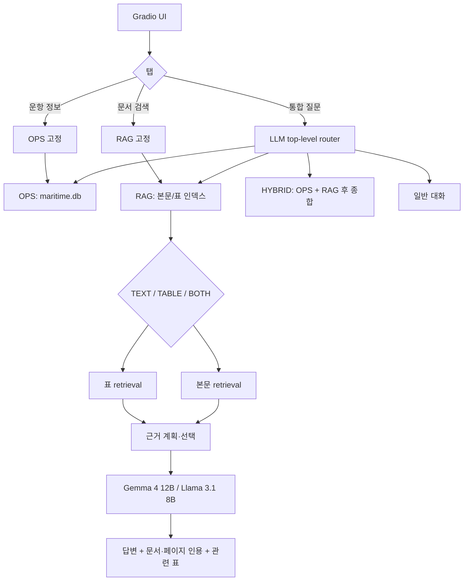

# 아키텍처·라우팅·임베딩·검색

이 문서는 현재 코드에서 실제 사용하는 흐름만 설명합니다. 과거 실험별 문서는 제거했고, 재현에 필요한 설정과 파일 위치를 한곳에 모았습니다.

## 1. 전체 흐름



주요 진입점은 다음과 같습니다.

| 영역 | 파일 |
|---|---|
| UI | `app.py` |
| 최상위 orchestration | `services/orchestrator.py` |
| 질문 라우팅 | `router/intent_router.py` |
| 문서 서비스 | `services/rag_service.py` |
| 운항 서비스 | `services/ops_service.py` |
| 문서 검색 실행 | `rag/scripts/rag_inprocess.py` |
| 검색 신호 분석 | `rag/scripts/retrieval_query_analysis.py` |
| 본문 검색·재순위 | `rag/scripts/retrieval_search.py` |
| 회의문서 Dense+BM25 | `rag/scripts/meeting_hybrid_retrieval.py` |
| evidence 계획·보강 | `rag/scripts/evidence_planner.py` |
| 답변 생성·인용 | `rag/scripts/rag_answer_lib.py` |

## 2. 라우팅

### UI 단위 라우팅

- **통합 질문**: `chat`, `ops`, `rag`, `hybrid` 중 정보원을 LLM이 판단합니다.
- **문서 검색**: 최상위 분류를 건너뛰고 `rag`로 고정합니다.
- **운항 정보**: 최상위 분류를 건너뛰고 `ops`로 고정합니다.

과거처럼 rule router와 LLM router를 UI에서 비교 선택하지 않습니다. 다만 LLM 호출 실패, JSON 불량, 저신뢰처럼 서비스가 멈출 수 있는 경우에는 hard guard와 결정적 fallback이 남아 있습니다. 이는 주 라우터가 아니라 장애 안전장치입니다.

`hybrid`는 질문을 운항용과 문서용으로 나눠 각각 처리한 뒤 하나의 답변으로 합칩니다. 예: “우리 선박 CII 상태와 관련 MEPC 요구사항을 같이 설명해줘.”

### RAG 내부 모드

최상위 `rag`가 정해진 뒤 질문을 다시 `text`, `table`, `both`로 분류합니다.

- `text`: 규정 설명, 회의 결과, 적용 범위, 정의, 요구사항
- `table`: 시험 횟수, 허용값, 수치 비교, 특정 행·열 조회
- `both`: 표의 수치와 본문 조건을 함께 요구

## 3. 임베딩과 인덱스

본문과 표는 같은 임베딩 모델을 사용하지만 collection을 분리합니다.

| 항목 | 본문 | 표 |
|---|---|---|
| collection | `full_corpus_715_v1` | `full_corpus_715_tables_precise_v1` |
| 모델 | `intfloat/multilingual-e5-base` | 동일 |
| 모델 revision | `d128750597153bb5987e10b1c3493a34e5a4502a` | 동일 |
| chunk 정책 | `chunk-v1-420-60` | 동일 |
| 최대 토큰 / overlap | 420 / 60 | 420 / 60 |
| 구조화 표 | 제외 | 표만 포함 |
| 임베딩 입력→출력 chunk | 267,305→272,295 | 166,045→191,720 |

manifest는 각 인덱스의 `index_manifest.json`에 있습니다. collection 기본값은 `project_paths.py`에서 관리하며 환경변수로 바꿀 수 있습니다.

```powershell
$env:MARITIME_RAG_TEXT_COLLECTION="full_corpus_715_v1"
$env:MARITIME_RAG_TABLE_COLLECTION="full_corpus_715_tables_precise_v1"
```

이번 검색 개선에는 재임베딩이 필요하지 않습니다. 기존 Chroma 벡터와 BM25 자료를 그대로 사용하고, query 분석·후보 유입·문서 내부 검색·최종 근거 선택을 바꿨습니다.

## 4. 현재 검색 알고리즘

### 4.1 질문 분석

`retrieval_query_analysis.py`가 다음 신호를 추출합니다.

- IMO 회의와 차수: MSC 111, MEPC 84 등
- 문서·규칙 식별자: DNV-CG-0264, Section 15, Part 7 등
- 선급과 포함·제외 조건: DNV만, KR 제외 등
- 회의 결과/제안/최종결정 구분
- 표·정의·범위·수치·비교 질문 여부
- 검색 확장에 쓸 한·영 동의어와 기술 용어

### 4.2 후보 문서 회수

1. E5 dense 검색으로 의미가 가까운 청크를 찾습니다.
2. BM25로 문서코드, 조항명, 수치처럼 literal match가 중요한 후보를 보강합니다.
3. 두 결과를 RRF와 카테고리 가중치로 결합합니다.
4. 질문에 정확 식별자가 있으면 전체 BM25 스캔보다 우선해 파일명·메타데이터에서 해당 문서를 직접 후보에 넣습니다.
5. 회의차수·선급·문서 registry와 충돌하는 자료는 감점하거나 제외합니다.

이 단계의 목표는 “정답 문서가 후보군에 들어왔는가”입니다.

### 4.3 문서 내부 근거 검색

정답 문서를 찾은 뒤에도 첫 청크만으로는 답이 완성되지 않을 수 있습니다. 그래서:

- 질문의 요구사항을 정의·범위·수치·일정·결론 같은 evidence slot으로 나눕니다.
- 우선 문서 안에서 sparse 조항 검색과 focus term 검색을 다시 수행합니다.
- 같은 표현이 없는 경우 bilingual alias와 문서 맥락을 사용합니다.
- 중복 청크를 줄이고, 여러 slot을 덮는 청크를 최종 컨텍스트에 남깁니다.
- 회의 결과 질문은 제안문보다 report/WP의 결정 문구를 우선합니다.

이 단계의 목표는 “찾은 문서 안에서 답에 필요한 모든 근거를 모았는가”입니다.

### 4.4 표 검색

표 질문은 precise-table collection에서 table row, markdown, summary 청크를 함께 찾습니다. 수치만 반환하지 않고 원문 파일·페이지·표 crop을 연결합니다. 질문이 본문 조건까지 요구하면 `both`로 실행해 본문 근거와 표 근거를 합칩니다.

### 4.5 답변 생성

선택된 근거만 Gemma/Llama에 전달합니다. 답변에는 `[n]` 인용을 붙이고 UI의 Evidence Table에서 문서, 페이지, 근거 청크를 확인할 수 있습니다. 근거가 없는 negative 질문은 그럴듯한 주변 내용을 채우지 않고 확인 불가로 응답하도록 별도 처리합니다.

## 5. 현재 강점과 한계

강점:

- 정확 문서코드·선급·회의차수가 있는 단일 문서 질의
- 잘못된 전제를 바로잡는 질문
- 존재하지 않는 근거를 요구하는 질문의 거절
- 표와 원문 페이지를 함께 제시하는 질의

남은 한계:

- 긴 한 문서에서 서로 멀리 떨어진 세부 조건을 여러 개 요구하면 일부 slot이 누락될 수 있음
- 여러 회의문서나 선급문서를 동시에 통합할 때 모든 gold 문서를 유지하는 비율이 낮아짐
- 후보 문서 recall에 비해 최종 semantic evidence recall이 낮아, 문서 내부 근거 선택이 병목
- 평균 응답시간 약 8초 중 생성이 약 6초이므로 더 빠른 모델, 출력 길이 제한, warm keep-alive가 속도 개선에 가장 직접적

개선 우선순위는 [평가 방법과 결과](EVALUATION.md)에 정리했습니다.
