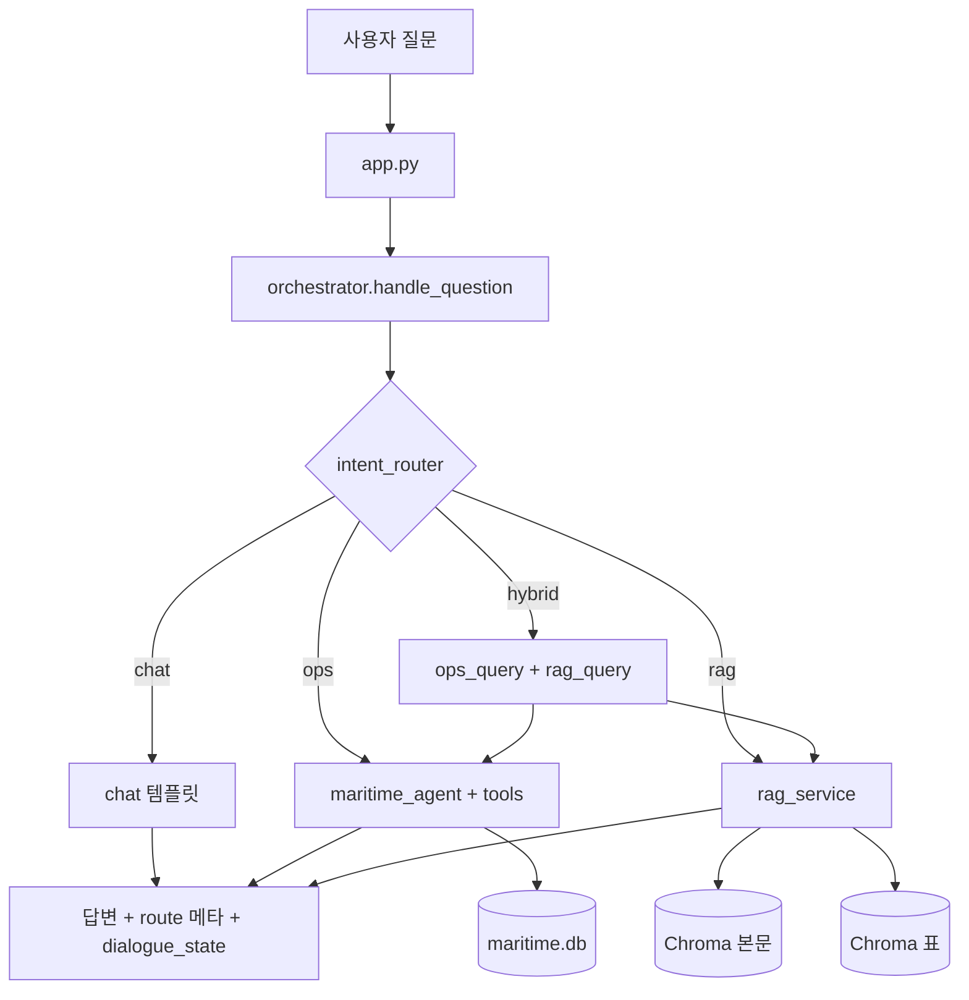

# MaritimeOpsRAG 시스템 아키텍처 (상세)

이 문서는 [yoonmojeon/20260805](https://github.com/yoonmojeon/20260805) 통합 서비스가
**운항(정형) 데이터**와 **문서(비정형) 데이터**를 어떻게 다루는지,
**라우팅이 어디에 끼는지**, **빌드 타임 vs 질의 타임**이 어떻게 나뉘는지
공부·인수인계용으로 정리한 것입니다.

짧은 사용 절차는 [사용매뉴얼.md](사용매뉴얼.md)를, 표 빌드 재현은
[TABLE_EMBEDDING_PIPELINE.md](TABLE_EMBEDDING_PIPELINE.md)를 참고하세요.

---

## 0. 한 줄로 이해하기

MaritimeOpsRAG는 “모든 걸 한 모델에 넣는 챗봇”이 아니라,

1. **데이터 특성에 맞는 저장소**를 미리 만들고 (빌드 타임)
2. 질문이 오면 **어느 저장소를 쓸지 고른 뒤** (라우팅)
3. 그 저장소에 맞는 **실행기**로 답을 만듭니다 (질의 타임).

최상위 경로는 주제(동향 / MASS / 표QA)가 아니라 **데이터 소스**입니다.

| 경로 | 의미 | 저장소 | LLM 역할 |
|------|------|--------|----------|
| `chat` | 인사·소개·능력·애매한 질문 | 없음 | 거의 없음 (템플릿) |
| `ops` | 이 선박의 운항·CII·리포트 | SQLite `data/maritime.db` | 툴 선택·문장화 |
| `rag` | 선급·IMO·규정·표 | Chroma (본문 + 표) | 검색 근거 기반 답변 |
| `hybrid` | 운항 숫자 + 문서 규정 같이 | SQLite + Chroma | 각각 실행 후 합침 |

```text
[빌드 타임]  운항 Excel → SQLite
             PDF 본문  → 텍스트 청크 → Chroma (본문)
             PDF 표    → TATR 정밀 표 → Chroma (표)

[질의 타임]  질문 → intent_router → chat | ops | rag | hybrid → 답
```

**중요:** 라우팅은 데이터를 “만드는” 단계가 아닙니다.
인덱스가 이미 준비된 뒤, 질문마다 **어느 문을 열지** 고르는 스위치입니다.

---

## 1. 왜 데이터를 둘로 나누나

| 구분 | 운항 (ops) | 문서 (rag) |
|------|------------|------------|
| 원천 | 센서·Noon·스케줄 Excel | 선급 Rule, IMO MEPC/MSC PDF |
| 성격 | 숫자, 시간, 항차 ID | 문장, 조항, 표 격자 |
| “정답”의 의미 | 계산·집계가 재현 가능해야 함 | 근거 문단·표 셀을 인용해야 함 |
| 실패 모드 | DB/항차/연도 데이터 없음 | 검색 미스, 요약 실패 |
| 처리 방식 | SQL + 공식(CII) + 리포트 생성 | 임베딩 검색 + LLM |

같은 단어(예: `CII`)라도 단서가 다릅니다.

- “올해 우리 배 CII” → **ops** (온보드 계산)
- “MEPC에서 CII 규제” → **rag** (문서)

이 구분을 라우터가 단서·슬롯으로 수행합니다.

---

## 2. 빌드 타임 — 운항(정형) 파이프라인

### 2.1 원천과 결과물

| 항목 | 경로 |
|------|------|
| 원천 Excel | `data/ho_data/*.xlsx` |
| 로더 | `ops/scripts/load_hodata.py` |
| 결과 DB | `data/maritime.db` |
| 스키마·접근 | `ops/agent/db_schema.py`, `ops/agent/data_store.py` |

대략적인 테이블 역할:

- 선박 메타 (`vessel` 등)
- 시간별 센서 (`sensor_log`)
- 항차 (`voyages` — Schedule 우선, 없으면 SOG 등으로 추정)

### 2.2 질의 시 실행 경로

```text
질문 (ops로 라우팅됨)
  → services/ops_service.run_ops_query
  → ops/agent/maritime_agent.py   # Ollama tool-calling 루프
  → ops/agent/tools.py            # SQL 집계 / 리포트
  → ops/agent/cii.py              # CII 공식·등급 (단일 소스)
  → (선택) 항차 지도 HTML, Noon/MRV docx
```

대표 툴 예:

- `get_current_voyage_status` — 현재 항차·위치·속도 등
- `get_voyage_analysis` — 항차 분석
- `calculate_cii_rating` — attained/required CII·등급
- `calculate_emissions` — 배출량
- `generate_noon_report` / `generate_mrv_*` — 보고서 생성

프롬프트(툴 사용 규칙)는 `prompts/ops.py`만 수정합니다.

### 2.3 운항 경로의 설계 포인트

- LLM이 숫자를 **지어내지 않도록** 툴 결과를 근거로 씁니다.
- 데이터가 없으면 “없음/계산 불가”가 정상 동작입니다.
  (혼합 평가에서 ops weak로 남는 경우가 여기에 해당)
- 규정 해석·회의 요약은 ops의 일이 아닙니다.

---

## 3. 빌드 타임 — 문서(비정형) 파이프라인

PDF는 **본문**과 **표**의 정보 구조가 달라 인덱스를 분리합니다.
경로·기본 컬렉션 이름은 `project_paths.py`가 단일 기준입니다.

| 항목 | 기본값 |
|------|--------|
| PDF 원본 | `data/raw_pdfs/` (로컬; Git에 대용량 PDF는 보통 없음) |
| 본문 청크 | `data/processed/chunks/` |
| 정밀 표 청크 | `data/processed/chunks_tables_precise/` |
| Chroma 루트 | `data/processed/index/unified_<collection_id>/` |
| 본문 컬렉션 | `full_corpus_715_v1` |
| 표 컬렉션 | `full_corpus_715_tables_precise_v1` |
| 매니페스트 | `data/manifests/full_corpus_715.csv` |
| 임베딩 | `intfloat/multilingual-e5-base` (로컬 sentence-transformers) |

### 3.1 본문 인덱스

```text
PDF
 → 레이아웃/전처리
 → 텍스트(및 picture) 청크
 → e5 임베딩
 → Chroma: full_corpus_715_v1
 → (선택) BM25 희소 인덱스
```

관련 스크립트 예: `rag/scripts/rebuild_full_corpus_715.py`,
`rag/scripts/10_build_unified_index.py`, `rag/scripts/35_build_bm25_index.py`.

본문 인덱스에서는 **구조화 표를 약하게 두거나 제외**하고,
표 질의는 아래 정밀 표 파이프라인으로 보내는 편이 낫습니다.

### 3.2 정밀 표 인덱스

표는 “문장 검색”만으로는 셀 정렬·주기·선령 구간이 깨지기 쉽습니다.
그래서 탐지 → 구조 → 좌표 스냅 → 텍스트 → (KR) 특수문자 복원 → 청킹 → 인덱스의
다단계 파이프라인을 씁니다.

대표 오케스트레이터: `rag/scripts/70_build_precise_table_corpus.py`  
약한 표 수리/격리: `rag/scripts/71_repair_weak_precise_tables.py`

개념적 단계:

```text
preprocess / prepare
  → TATR 구조 인식
  → PDF 벡터 좌표에 snap
  → PyMuPDF 셀 텍스트
  → HancomEQN PUA 복원 (KR 등; 미매핑은 quarantine)
  → 복합 표 segment / region-TATR (필요 시)
  → table_row + table_summary 청크
  → Chroma: full_corpus_715_tables_precise_v1
```

청크는 마크다운 표 복사가 아니라, 검색에 유리한
`열N=값 | …` 형태의 **평문 직렬화**에 가깝습니다.

상세 재현·의존성·주의사항은
[TABLE_EMBEDDING_PIPELINE.md](TABLE_EMBEDDING_PIPELINE.md)를 보세요.

### 3.3 질의 시 RAG 실행

```text
질문 (rag로 라우팅됨)
  → services/rag_service.run_rag_query
  → (표 힌트?) 표 인덱스 / dual 검색
  → rag/scripts/rag_inprocess.py 등 검색·생성
  → answer_contract 로 답변 형식 정리
```

**표 힌트** (`services/orchestrator.py`의 `TABLE_HINTS`):
`표`, `선령`, `정기검사`, `평형수탱크`, `밸러스트`, `검사 주기`, `검사주기` 등.

**Dual 검색** (환경·설정에 따라):

- 표 힌트가 있고 본문·표 인덱스가 모두 준비되면
  두 컬렉션을 검색한 뒤 (`search2`) 근거를 fuse하고 LLM은 한 번 (`llm1`)
- 평가 속도를 위해 `MARITIME_RAG_DUAL=0`으로 dual을 끌 수 있음

RAG 공통 정체성 prefix는 `prompts/rag.py`입니다.
회의 요약·Rule·표QA 세부 프롬프트는 `rag/scripts/` 쪽에 두는 편입니다.

---

## 4. 질의 타임 — 라우팅

### 4.1 위치

```text
app.py (Gradio)
  → services/orchestrator.handle_question
  → router.intent_router.route_question
  → chat_service | ops_service | rag_service | hybrid_service
```

프롬프트:

- `prompts/chat.py` — 안내
- `prompts/ops.py` — 운항 에이전트
- `prompts/rag.py` — RAG 정체성
- `prompts/router_prompt.py` — LLM 라우터용 (저신뢰 구간)

단서·점수: `router/cues.py`  
대화 상태: `router/dialogue.py`  
질문 펼치기·hybrid 분해: `router/rewrite.py`

### 4.2 분류 원칙

- 문장 전체를 외우지 않고 **단서·슬롯**만 본다.
- 구어체도 ops/rag로 보낸다. (“지금 배 어디야”, “작년에 회의에서 CII…”)
- 단서가 없으면 **chat에서 되묻기**. 추측으로 rag에 보내지 않는다.
- 명시적 dual/비교만 **hybrid**. 점수만 비슷하면 chat.
- CII/배출은 단어가 아니라 단서로 나눈다.
  - 우리/올해/항차 → ops
  - MEPC/규정/회의 → rag
- 능력 질문(“운항이랑 문서 둘 다 가능해?”)은 **chat** (내용 요청이 아님).

### 4.3 대략적인 결정 순서

1. 강제 경로 (UI에서 ops/rag/chat/hybrid 지정)
2. 화행: 인사 / 감사 / 메타 / 능력·소개 → `chat`
3. 대화 상태 기반 후속·전환 (짧은 “그럼/그거”, 경로 전환 표현)
4. 키워드 점수 (`OPS_PATTERNS` / `RAG_PATTERNS` + overlap 보정)
5. 프로토타입 투표
6. (옵션) Ollama JSON 라우터
7. 그래도 애매하면 `chat` clarify

### 4.4 Hybrid

원문을 그대로 두 번 넣지 않습니다.

1. `split_hybrid_queries`로 ops용·rag용 질의로 분해
2. 각각 실행
3. 출처를 라벨해 합침 (`services/hybrid_service.py`)

### 4.5 멀티턴

`dialogue_state`에 최근 경로·주제·엔티티를 유지합니다.
짧은 후속 질문은 이전 경로를 유지하거나, “문서 쪽으로 / 운항으로” 같은
전환 단서로 경로를 바꿉니다.

---

## 5. 사용자 질문 한 번의 전체 흐름



응답에 같이 실리는 것(개념):

- 답변 텍스트
- 선택된 `route` / 점수 / method (rules, multiturn, llm 등)
- (ops) 생성 파일 경로, 지도 HTML
- 다음 턴용 `dialogue_state`

---

## 6. 디렉터리 지도

```text
20260805/
├── app.py                 # 통합 Gradio UI
├── project_paths.py       # DB/컬렉션 기본 경로
├── router/                # 의도 분류 (cues, dialogue, rewrite)
├── prompts/               # chat / ops / rag / router 프롬프트만
├── services/              # orchestrator + chat/ops/rag/hybrid 브리지
├── ops/
│   ├── scripts/load_hodata.py
│   └── agent/             # tools, cii, maritime_agent, data_store
├── rag/
│   └── scripts/           # 전처리·인덱스·검색·표 파이프라인
├── data/
│   ├── ho_data/           # 운항 Excel (로컬)
│   ├── maritime.db        # 운항 SQLite (로컬 생성)
│   ├── raw_pdfs/          # PDF (로컬; 보통 Git 제외)
│   ├── manifests/         # 코퍼스 목록
│   ├── config/            # HancomEQN 매핑 등
│   ├── eval/              # 혼합 평가 스위트 등
│   └── processed/         # chunks / chroma / logs (로컬)
├── docs/                  # 본 문서, 매뉴얼, 표 파이프라인
├── scripts/               # 평가·빌드 헬퍼
└── tests/                 # 라우터 골든 등
```

Git에 안 올리는 것(일반적): 원본 PDF, 모델 가중치, Chroma 바이너리,
대용량 청크·로그, `.venv`, API 키.

---

## 7. 평가와 품질 관점

혼합 경로 스모크 예:

- 스위트: `data/eval/suite_100_mixed.json` (chat/ops/text/table 혼합)
- 러너: `scripts/run_eval_suite_100.py`
- 결과: `data/processed/logs/suite_100_mixed_results.json`

라우터만: `python tests/run_router_eval.py`

해석 팁:

- `route_mismatch` → 단서/라우터 문제 (데이터 파이프라인과 별개)
- `weak` + ops → DB·툴·연도 슬롯 문제
- `weak` + rag → 검색·요약·커버리지 문제

---

## 8. 공부할 때 추천 읽기 순서

1. 이 문서 (`docs/ARCHITECTURE.md`) — 큰 그림
2. `services/orchestrator.py` — 실제 스위치
3. `router/intent_router.py` + `router/cues.py` — 왜 그 경로인지
4. `ops/scripts/load_hodata.py` → `ops/agent/tools.py` → `ops/agent/cii.py`
5. `project_paths.py` — 컬렉션 이름
6. `docs/TABLE_EMBEDDING_PIPELINE.md` + `rag/scripts/70_build_precise_table_corpus.py`
7. `services/rag_service.py` — dual / 표 힌트
8. `docs/사용매뉴얼.md` — UI로 손으로 검증

---

## 9. FAQ

**Q. 라우팅을 먼저 했나, 데이터 처리를 먼저 했나?**  
A. **데이터 처리를 특성별로 먼저** 두고, 질의 시 라우팅으로 연결합니다.
코드상으로도 `load_hodata` / Chroma 빌드가 선행되어야 ops·rag가 의미 있습니다.

**Q. 표 QA는 최상위 경로인가?**  
A. 아닙니다. 최상위는 `rag`이고, 표 힌트·dual 검색은 RAG **내부** 동작입니다.

**Q. chat인데도 LLM을 쓰나?**  
A. 기본 안내·인사는 템플릿입니다. DB/Chroma를 건드리지 않는 것이 규칙입니다.

**Q. hybrid와 “둘 다 가능해?”의 차이는?**  
A. “가능해?”는 **시스템 능력** → chat.  
“운항이랑 문서 둘 다 알려줘 / 규정 기준으로 우리 CII”는 **내용 요청** → hybrid.

**Q. 로컬에 인덱스가 없으면?**  
A. 앱은 뜨지만 rag/ops가 준비 안내를 냅니다. 매뉴얼의 상태 확인 명령을 쓰세요.

---

## 10. 관련 링크

- 저장소: https://github.com/yoonmojeon/20260805
- 사용 매뉴얼: [사용매뉴얼.md](사용매뉴얼.md)
- 표 임베딩 파이프라인: [TABLE_EMBEDDING_PIPELINE.md](TABLE_EMBEDDING_PIPELINE.md)
